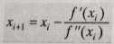

:toc: macro
toc::[]

= *ÇOK BOYUTLU KISITLAMASIZ OPTİMİZASYON* +
== *GRADYEN YÖNTEMLERİ* +
Adından da anlaşılacağı gibi, *gradyen yöntemleri*, optimumu belirleyen etkili algoritmalar üretmek için türev bilgilerini doğrudan kullanır. En hızlı artan veya en hızlı azalan yön olarak da adlandırılır. İlk adım olarak bir başlangıç noktası seçilir ve amaç fonksiyonunu en hızlı geliştiren yönde hareket edilir. 

=== *Gradyenler ve Hessianlar* +
Bir boyutlu fonksiyonun birinci türevi, diferansiyeli alınan fonksiyonun eğilimini veya o noktadaki teğetini ifade eder.

 Örneğin; eğimin pozitif olması, bağımsız değişkeni artırmanın incelenen fonksiyonun değerini artıracağı 
 anlamındadır. 
 
 Ayrıca birinci türev fonksiyonun optimum bir noktasına ne zaman erişeceğini de ifade eder, türevin sıfıra 
 gittiği nokta.

*Gradyen* +
İki boyutlu bir _f(x,y)_ fonksiyonunu ele alalım ve bu fonksiyonun bir dağın üzerindeki konumumuzu temsil ettiğini varsayalım. Dağın üzerinde belirli bir _(a,b)_ konumunda olduğunuzu düşünelim. Herhangi bir doğrultudaki eğim; yönü belirtmenin bir yolu, yöne bağlı gradyen x ekseni ile _θ_ açısı yapan  bir _h_ ekseni boyunca tanımlanır. Bu yeni eksen boyunca yükseklik yeni bir _g(h)_ fonksiyonu olarak düşünülebilir. Eğer konumunuzu bu eksenin başlangıcı olarak tanımlarsanız _(yani h=0)_, bu yöndeki eğim _g'(0)_ olacaktır. Yöne bağlı türev adı verilen bu eğim x ve y eksenleri boyunca alınan kısmi türevlerle hesaplanabilir.

image::resim1.png[Giriş,width=25%]

Burada kısmi türevler _x=a_ ve _y=b_ noktalarında hesaplanmıştır. Amacımız, bir sonraki adımda en fazla yükseltiyi sağlamak olduğundan; *_"En dik çıkış hangi yöndedir ?"_* sorusuna yanıt bulmamız gerekir. 

image::resim2.png[Giriş,width=15%]

Gradyen (Del f olarak da adlandırılan vektör)  yukarıdaki şekildeki gibi ifade edilir. _f(x,y)_ fonksiyonunun _x=a_ ve _y=b_ noktasındaki yöne bağlı türevini ifade eder. +
*Gradyeni nasıl kullanırız?* +

 Dağa tırmanma problemi için, eğer en hızlı şekilde yükseklik kazanmak istiyorsak gradyen bize yerel 
 olarak hangi yönde ilerlememiz gerektiğini ve bu yönde gidersek ne kadar kazanacağımızı söyler. 
 Ancak bu stratejinin bizi her zaman doğrudan zirveye ulaştırmayacağını unutmamalıyız.
 
*Hessian* +
Bir boyutlu problemlerde hem birinci türev hem de ikinci türev optimumun aranmasında önemlidir. Birinci türev (_i_ ) fonksiyonun en dik yörüngesini belirler ve (_ii_ ) optimuma ulaşıldığını belirtir. Optimum noktasına gelindiğinde ikinci türev bir maksimumda mı (negatig _f''(x)_) yoksa bir minimumda mı (pozitif _f''(x)_) olduğumuzu söyler. Bir minimum mu yoksa maksimum mu olduğunu sadece x ve y'ye göre ikinci türevlerle değil aynı zamanda x ve y'ye göre karışık ikinci türeve de bağlıdır. 

image::resim3.png[Giriş,width=25%]

Üç durum söz konusu olabilir: 

image::resimpng4.png[Giriş,width=50%]
Çok boyutlu bir fonksiyonun optimuma ulaşıp ulaşmadığını anlamak için bir yol sunmasının yanında *Hessian'ın* optimizasyonda başka kullanım alanları da vardır. + 
*Örnek 1* +
(4,2) noktasında basınç gradyeni yönünde bir boyutlu bir denklem geliştirin.Basınç fonksiyonu f(x,y)=5*x**2*y-8*y**2-7*x**2 şeklinde verilmiştir. +
*NOT:PYTHON DİLİYLE YAZILMIŞTIR. VERSİON:2.7*
-------------------------------------------------
from sympy import *
import math
x=Symbol('x')
y=Symbol('y')
xi=4    #x degeri
yi=2    #y degeri
denklem=5*x**2*y-8*y**2-7*x**2
print "Denklem:"+denklem.diff(x).subs(x,xi).subs(y,yi).__str__()+"cos T + " +denklem.diff(y).subs(x,xi).subs(y,yi).__str__() +"sin T"
-------------------------------------------------
*ÇIKTI* +
Denklem:24cos T + 48sin T +

*Örnek 2* +
(1,1) noktasında sıcaklık gradyeni yönünde bir boyutlu denklem geliştiriniz.Bir sıcaklık fonksiyonu f(x,y)=2*x**3*y**2-6*x*y+x**2+4*y şeklinde verilmiştir. +
*NOT:PYTHON DİLİYLE YAZILMIŞTIR. VERSİON:2.7*
-------------------------------------------------
from sympy import *
import math
x = Symbol('x')
y = Symbol('y')
xi = 1  # x degeri
yi = 1  # y degeri
denklem = 2 * x ** 3 * y ** 2 - 6 * x * y + x ** 2 + 4 * y
print "Denklem:" + denklem.diff(x).subs(x, xi).subs(y, yi).__str__() + "cos T + " + denklem.diff(y).subs(x, xi).subs(y,yi).__str__() + "sin T"
-------------------------------------------------
*ÇIKTI* +
Denklem:2cos T + 2sin T

== *NEWTON YÖNTEMLERİ* +
*Gradyensiz Newton Yöntemi* +
Gradyensiz Newton Yöntemi f(x)=0 olacak şekilde bir fonksiyonun kökünü bulan açık bir yöntemdir. Ve,

İfadesiyle özetlenir. +
   g(x)=f’(x) şeklinde yeni bir fonksiyon tanımlayarak f(x)’in optimumunu bulmak için benzer bir açık yaklaşım kullanılabilir. Böylece, aynı optimum değer x*, her iki fonksiyonu da sağlayacaktır. +
   f’(x*)=g(x*)=0 +
Dolayısıyla,

İfadesi f(x)’in maksimum ve minimumunu bulmak için bir teknik olarak kullanılabilir. Aynı denklem, f(x) için ikinci derece Taylor serisi yazılarak ve serinin türevi sıfıra eşitlenerek de elde edilebilir. 

*Örnek 1* +
Newton Yöntemini ve Xo=2.5 ilk tahminini kullanarak f(x)=2* sin(x) - (x**2/10) fonksiyonunun maximumunu bulma işlemlerini gerçekleştiriniz. +
*NOT:PYTHON DİLİYLE YAZILMIŞTIR. VERSİON:2.7* +
--------------------------------------------
from sympy import *
x = Symbol('x')
y = Symbol('y')
tahmin=2.495081551326
denklem=(2* sin(x) - (x**2/10))
birinciTurev=denklem.diff(x)
ikinciTurev=birinciTurev.diff(x)
i=1
print "Tahmin Sayisi:    "+"Tahmin Degeri:   "+"Fonksiyon Aldigi Deger:  "
while i<=9:
    print "     "+i.__str__()+"             "+tahmin.__str__()+"      "+denklem.subs(x,tahmin).__str__()
    tahmin = tahmin - (birinciTurev.subs(x, tahmin)) / (ikinciTurev.subs(x, tahmin))
    i=i+1
*ÇIKTI* +
Tahmin Sayisi:    	Tahmin Degeri:   	Fonksiyon Aldigi Deger:  
     1             		2.49508155133      	0.582267351471577
     2             		1.00349460310183      1.58600782806794
     3             		1.46674482756487      1.77404901121016
     4             		1.42763376475062      1.77572564582236
     5             		1.42755177920468      1.77572565314742
     6             		1.42755177876459      1.77572565314742
     7            		1.42755177876459      1.77572565314742
     8             		1.42755177876459      1.77572565314742
     9            		1.42755177876459      1.77572565314742

